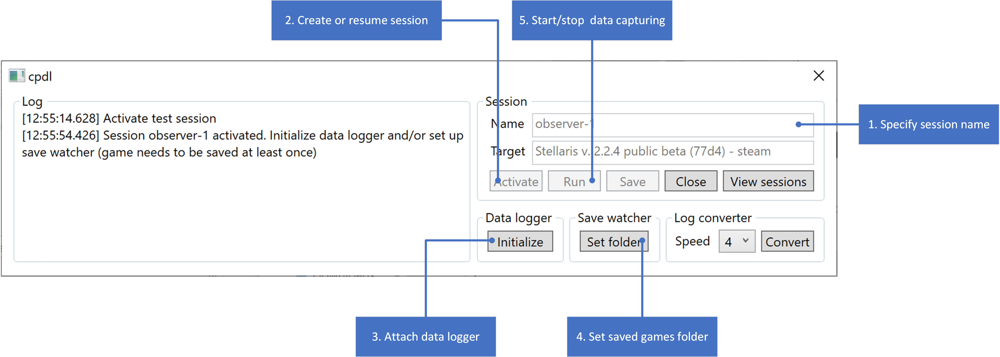

# clausewitz-performance-data-logger
This is a collection of tools merged with an UI in hopes of making it more user-friendly. It aimss to work with any modern game built on Clausewitz engine, but currently only fully supporting Stellaris.

# What does it do?
It consists of two main modules: **data logger** and **save watcher**, which are combined in a single **test session**.

**Data logger** attaches to process and captures the time it takes to pass from one day to the other.

**Save watcher** monitors saved games folder and automatically backs up (auto)saves.

**Test session** can be run with either or both modules active. When test is running, the OS is prevented to enter sleep mode.

# Is memory reading safe to use?
Use at your own risk. As a safe mechanism, there is a simple process check for stuff that might have anti-cheat protection (Steam, Origin, etc.). It will prevent attaching data logger to game's process if any of these are around.

# How to configure it?
Currently the configuration is only possible via manually replacing 
**.config** file.

# How to prepare game for test session?
1. Reboot the test machine and kill whatever processes might affect performance (Discord overlays, background downloaders, cryptocurrency miners, etc.);
2. Start up the game, create new or load existing game, make sure the game is saved at least once and is paused;
3. Decide which game speed will be used. For passive (observer or overnight) test I recommend using 4 (Fastest), for actual gameplay use whatever you are comfortable playing at. Do note that **changing game speed within session will make results useless**. Pausing during test session is ok;
4. Set up desired game speed, use `3dstats` console command if FPS values need to be captured and make any other preparations you might need (`observe`, `human_ai`, etc.);
5. The tool can be set up now.

# Setting up the tool

1. Specify session name;
2. Click on "Activate" button to start new or resume previous session;
3. Attach data logger by clicking on "Initialize" button. You may be asked to kill additional processes;
4. Specify saved games folder by clicking on "Set folder" button;
5. Once either data logger or save watcher is setup, clicking on "Run" button will start capturing data/monitoring saved games folder;
6. Game can be unpaused now.

# Data loss prevention
There is no automatic saving of the captured data on regular intervals/certain buffer size as data logger was designed with maximum recording performance in mind.

The tool *should* be able of not losing captured data in the unfortunate event of game or tool itself crashing. However, it is recommended to click on "Save" button from time to time. It is recommended to pause game before doing so.

# Finishing test session
1. Click on "Stop" button to save captured data and put data logger and save watcher to passive state;
2. Select the speed game was played on from the dropdown menu and click on "Convert" button;
3. Close the session by clicking on "Close" button.

# Processing the results
The outcome of the session is a **.csv** file and\or bunch of backed up saved games.

The **.csv** file can be fed to Excel, MATLAB, GNU Octave or other plotting software for visualization. Do note that captured delta is in ticks, divide by 10000 to get value in milliseconds. Due to high data density it is recommended to smoothen the captured data. Sample MATLAB sheet is coming soon.

Saved games can be used to backtrack where some oddities occurred and to extract additional data (e.g. fleets, pops, resources). Saved games processer is coming soon.

# How to update memory offsets?
Coming soon.

# TODO
- `3dstats` command is not suppported by all games, so data logger and log converter should take it into account;
- merge all *Last files into one snapsot file;
- proper handling of reloaded games cases for save watcher and log conveter.